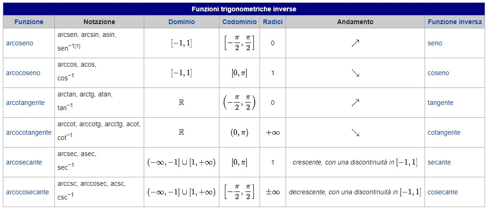

# ros-corso


-

# Installazione Ros

### Setup sources.list
```
sudo sh -c 'echo "deb http://packages.ros.org/ros/ubuntu $(lsb_release -sc) main" > /etc/apt/sources.list.d/ros-latest.list'
```

### Adding Key
```
sudo apt-key adv --keyserver 'hkp://keyserver.ubuntu.com:80' --recv-key C1CF6E31E6BADE8868B172B4F42ED6FBAB17C654
```

### Update package list
```
sudo apt-get update
```

### Installing ROS Kinetic Full Desktop Version
```
sudo apt-get install ros-kinetic-desktop-full
```

### Initialize Ros Dependencies
```
sudo rosdep init
```
```
rosdep update
```

### Setting up ROS Environment
```
printf "source /opt/ros/kinetic/setup.bash" >> ~/.bashrc
```
```
source ~/.bashrc
```

### Installing Python Packages for ROS
```
sudo apt-get install python-rosinstall
```
```
sudo apt install python-catkin-tools
```

### Other Important ROS Packages
```
sudo apt-get install ros-kinetic-tf-*
```
```
sudo apt-get install ros-kinetic-pcl-msgs ros-kinetic-mav-msgs ros-kinetic-mavros ros-kinetic-octomap-* ros-kinetic-geographic-msgs libgeographic-dev
```

### Creating Catkin Workspace
```
mkdir catkin_ws
```
```
cd catkin_ws
```
```
mkdir -p src
```
```
cd src
```
```
catkin_init_workspace
```
```
printf "source ~/catkin_ws/devel/setup.bash" >> ~/.bashrc
```
```
cd ~/catkin_ws
```
```
catkin_make
```
```
source ~/catkin_ws/devel/setup.bash
```

# Manda messaggio topic TurtleSim
```python
rostopic pub -r 1 /turtle1/cmd_vel geometry_msg/Twist [TAB] [TAB]
```

# Esercizi

## Esercizio 1

### Talker.py

```python

import rospy
from std_msgs.msg import String

def chatter_callback(message):
    rospy.loginfo(rospy.get_caller_id() + "I heard %s", message.data)

def listener():
    rospy.init_node('listener', anonymous=True)

    rospy.Subscriber('chatter', String, chatter_callback)

    rospy.spin()

if __name__ = '__main__'
    listener()


```
### Listener.py

```python

import rospy
from std_msgs.msg import String

#Creazione del topic con la classe Publisher
pub = rospy.Publisher('chatter', String, queue_size=10) #Nome Topic, Tipologia messaggio, Buffer

#Inizializiamo il nodo
#Nome del nodo, Anonymus significa che il node è unico
rospy.init_node('talker', anonymous=True)

#il numero 1 indicata la frequenza espressa in Hz
rate = rospy.Rate(1)

#Contatore
i=0

while not rospy.is_shutdown():
    hello_str = "hello world %s" % i
    rospy.loginfo(hello_str)
    pub.publish(hello_str)
    rate.sleep()
    i=i+1
```

## Esercizio 2

- IoT_message

```python
int32 id
string name
float32 temperature
float32 humidity
```
- Configurazione del CMakeLists.txt

- Creazione del subscriber e publisher

### iot_sensor_publisher_talker.py

```python
#!/usr/bin/env python
# license removed for brevity
import rospy
from ros_essentials_cpp.msg import IoTSensor
import random

#create a new publisher. we specify the topic name, then type of message then the queue size
pub = rospy.Publisher('iot_sensor_topic', IoTSensor, queue_size=10)

#we need to initialize the node
rospy.init_node('iot_sensor_publisher_node', anonymous=True)

#set the loop rate
rate = rospy.Rate(1) # 1hz
#keep publishing until a Ctrl-C is pressed
i = 0
while not rospy.is_shutdown():
    iot_sensor = IoTSensor()
    iot_sensor.id = 1
    iot_sensor.name="iot_parking_01"
    iot_sensor.temperature = 24.33 + (random.random()*2)
    iot_sensor.humidity = 33.41+ (random.random()*2)
    rospy.loginfo("I publish:")
    rospy.loginfo(iot_sensor)
    pub.publish(iot_sensor)
    rate.sleep()
    i=i+1
```
### iot_sensor_publisher_talker.py

```python
#!/usr/bin/env python
# license removed for brevity
import rospy
from ros_essentials_cpp.msg import IoTSensor
import random

#create a new publisher. we specify the topic name, then type of message then the queue size
pub = rospy.Publisher('iot_sensor_topic', IoTSensor, queue_size=10)

#we need to initialize the node
rospy.init_node('iot_sensor_publisher_node', anonymous=True)

#set the loop rate
rate = rospy.Rate(1) # 1hz
#keep publishing until a Ctrl-C is pressed
i = 0
while not rospy.is_shutdown():
    iot_sensor = IoTSensor()
    iot_sensor.id = 1
    iot_sensor.name="iot_parking_01"
    iot_sensor.temperature = 24.33 + (random.random()*2)
    iot_sensor.humidity = 33.41+ (random.random()*2)
    rospy.loginfo("I publish:")
    rospy.loginfo(iot_sensor)
    pub.publish(iot_sensor)
    rate.sleep()

    i=i+1
```

## Esercizio 3

#### ROS Services

##### Service Node

#### Open the Turtlesim simulator

```
roscsore
```

```
rosrun turtlesim turtlesim_node
```

Display the list of services
```
rosservice list
```
What is the command that shows the information of the service /reset
```
rosservice info /reset
```
Write the result of the execution of the command for the service /reset
```
Node: /turtlesim

URI: rosrpc://ace:xxx

Type: std_srvs/Empty
```
Args:

What is the command that shows the information of the service /kill
```
rosservice info /kill
```
Write the result of the execution of the command for the service /kill
```
Node: /turtlesim

URI: rosrpc://ace:xx

Type: turtlesim/Kill

Args: name
```


What is the command that shows the content of message turtlesim/Kill of the /kill service?
```
rosservice info /kill
```
Spaw one additional turtle called tsim1. Write the command.
```
rosservice call /spawn 7 7  0.55 tsim1   
```
use the service kill to kill tsim1.Write the command.  
```
rosservice call /kill tsim1
```
use the service reset to reset all the simulation. Write the command.
```
rosservice call /reset tsim1
```

## Server & Client

### Server

- server.py

```python

#!/usr/bin/env python

from ros_essentials_cpp.srv import AddTwoInts
from ros_essentials_cpp.srv import AddTwoIntsRequest
from ros_essentials_cpp.srv import AddTwoIntsResponse

import rospy

def handle_add_two_ints(req):
    print "Returning [%s + %s = %s]"%(req.a, req.b, (req.a + req.b))
    return AddTwoIntsResponse(req.a + req.b)

def add_two_ints_server():
    rospy.init_node('add_two_ints_server')
    s = rospy.Service('add_two_ints', AddTwoInts, handle_add_two_ints)
    print "Ready to add two ints."
    rospy.spin()

if __name__ == "__main__":
    add_two_ints_server()

```
### Client

- client.py

```python

#!/usr/bin/env python

import sys
import rospy
from ros_essentials_cpp.srv import AddTwoInts
from ros_essentials_cpp.srv import AddTwoIntsRequest
from ros_essentials_cpp.srv import AddTwoIntsResponse

def add_two_ints_client(x, y):
    rospy.wait_for_service('add_two_ints')
    try:
        add_two_ints = rospy.ServiceProxy('add_two_ints', AddTwoInts)
        resp1 = add_two_ints(x, y)
        return resp1.sum
    except rospy.ServiceException, e:
        print "Service call failed: %s"%e

def usage():
    return "%s [x y]"%sys.argv[0]

if __name__ == "__main__":
    if len(sys.argv) == 3:
        x = int(sys.argv[1])
        y = int(sys.argv[2])
    else:
        print usage()
        sys.exit(1)
    print "Requesting %s+%s"%(x, y)
    s = add_two_ints_client(x, y)
    print "%s + %s = %s"%(x, y, s)

```
## Esercizio 4

## Tabella Arcotangente



## Funzione Move
```python
def move(velocity_publisher, speed, distance, is_forward):
        #declare a Twist message to send velocity commands
        velocity_message = Twist()
        #get current location 
        global x, y
        x0=x
        y0=y

        if (is_forward):
            velocity_message.linear.x =abs(speed)
        else:
        	velocity_message.linear.x =-abs(speed)

        distance_moved = 0.0
        loop_rate = rospy.Rate(10) # we publish the velocity at 10 Hz (10 times a second)    
        
        while True :
                rospy.loginfo("Turtlesim moves forwards")
                velocity_publisher.publish(velocity_message)

                loop_rate.sleep()
                
                distance_moved = abs(math.sqrt(((x-x0) ** 2) + ((y-y0) ** 2)))
                print  (distance_moved)
                print(x)
                if  not (distance_moved<distance):
                    rospy.loginfo("reached")
                    break
        
        #finally, stop the robot when the distance is moved
        velocity_message.linear.x =0
        velocity_publisher.publish(velocity_message)
```
## Funzione Rotate
```python
def rotate (velocity_publisher, angular_speed_degree, relative_angle_degree, clockwise):
    
    velocity_message = Twist()

    angular_speed=math.radians(abs(angular_speed_degree))

    if (clockwise):
        velocity_message.angular.z =-abs(angular_speed)
    else:
        velocity_message.angular.z =abs(angular_speed)

    angle_moved = 0.0
    loop_rate = rospy.Rate(10) # we publish the velocity at 10 Hz (10 times a second)    
    cmd_vel_topic='/turtle1/cmd_vel'
    velocity_publisher = rospy.Publisher(cmd_vel_topic, Twist, queue_size=10)

    t0 = rospy.Time.now().to_sec()

    while True :
        rospy.loginfo("Turtlesim rotates")
        velocity_publisher.publish(velocity_message)

        t1 = rospy.Time.now().to_sec()
        current_angle_degree = (t1-t0)*angular_speed_degree
        loop_rate.sleep()


                       
        if  (current_angle_degree>relative_angle_degree):
            rospy.loginfo("reached")
            break

    #finally, stop the robot when the distance is moved
    velocity_message.angular.z =0
    velocity_publisher.publish(velocity_message)
```
## Funzione go_to_goal
```python
def go_to_goal(velocity_publisher, x_goal, y_goal):
    global x
    global y, yaw

    velocity_message = Twist()

    while (True):
        K_linear = 0.5 
        distance = abs(math.sqrt(((x_goal-x) ** 2) + ((y_goal-y) ** 2)))

        linear_speed = distance * K_linear

        K_angular = 4.0
        desired_angle_goal = math.atan2(y_goal-y, x_goal-x)
        angular_speed = (desired_angle_goal-yaw)*K_angular

        velocity_message.linear.x = linear_speed
        velocity_message.angular.z = angular_speed

        velocity_publisher.publish(velocity_message)
        print ('x=', x, ', y=',y, ', distance to goal: ', distance)

        if (distance <0.01):
            break
```
## Funzione setDesiredOrientation
```python
def gridClean(publisher):
 
    desired_pose = Pose()
    desired_pose.x = 1
    desired_pose.y = 1
    desired_pose.theta = 0
 
    go_to_goal(publisher, 1,1)
 
    setDesiredOrientation(publisher, 30, math.radians(desired_pose.theta))
 
    for i in range(5):
        move(publisher, 2.0, 1.0, True)
        rotate(publisher, 20, 90, False)
        move(publisher, 2.0, 9.0, True)
        rotate(publisher, 20, 90, True)
        move(publisher, 2.0, 1.0, True)
        rotate(publisher, 20, 90, True)
        move(publisher, 2.0, 9.0, True)
        rotate(publisher, 20, 90, False)
    pass
```

## Funzione gridClean
```python
def gridClean(publisher):
 
    desired_pose = Pose()
    desired_pose.x = 1
    desired_pose.y = 1
    desired_pose.theta = 0
 
    go_to_goal(publisher, 1,1)
 
    setDesiredOrientation(publisher, 30, math.radians(desired_pose.theta))
 
    for i in range(5):
        move(publisher, 2.0, 1.0, True)
        rotate(publisher, 20, 90, False)
        move(publisher, 2.0, 9.0, True)
        rotate(publisher, 20, 90, True)
        move(publisher, 2.0, 1.0, True)
        rotate(publisher, 20, 90, True)
        move(publisher, 2.0, 9.0, True)
        rotate(publisher, 20, 90, False)
    pass
```
## Ros Networking

Argomento | Link
------------ | -------------
ROS NetworkSetup | http://wiki.ros.org/ROS/NetworkSetup
Running ROS across multiple REMOTE machines | http://wiki.ros.org/ROS/Tutorials/MultipleRemoteMachines


## Ros Launch 

```bash
roslaunch [name_package] [name_file_launch]
```

Argomento | Link
------------ | -------------
ROS Launch| http://wiki.ros.org/roslaunch
ROS Launch Includes | http://wiki.ros.org/ROS/Tutorials/Roslaunch%20tips%20for%20larger%20projects
ROS Launch Params | http://wiki.ros.org/roslaunch/XML#Setting_parameters

### Esempio

```xml
<launch>
  <node name="turtlesim" pkg="turtlesim" type="turtlesim_node" />
  <node name="clean_node" pkg="ros_essentials_cpp" type="turtlesim_cleaner.py" output="screen" />
</launch>
```
## Ros Launch con i parametri

### Esempio con include

```xml
<launch>
  <group name="wg">
    <include file="$(find pr2_alpha)/$(env ROBOT).machine" />
    <include file="$(find 2dnav_pr2)/config/new_amcl_node.xml" />
    <include file="$(find 2dnav_pr2)/config/base_odom_teleop.xml" />
    <include file="$(find 2dnav_pr2)/config/lasers_and_filters.xml" />
    <include file="$(find 2dnav_pr2)/config/map_server.xml" />
    <include file="$(find 2dnav_pr2)/config/ground_plane.xml" />
    <!-- The navigation stack and associated parameters -->
    <include file="$(find 2dnav_pr2)/move_base/move_base.xml" />
  </group>
</launch>
```

### Esempio con parametri
```xml
<launch>
  <param name="somestring1" value="bar" />
  <!-- force to string instead of integer -->
  <param name="somestring2" value="10" type="str" />
  <param name="someinteger1" value="1" type="int" />
  <param name="someinteger2" value="2" />
  <param name="somefloat1" value="3.14159" type="double" />
  <param name="somefloat2" value="3.0" />
  <!-- you can set parameters in child namespaces -->
  <param name="wg/childparam" value="a child namespace parameter" />
  <!-- upload the contents of a file to the server -->
  <param name="configfile" textfile="$(find roslaunch)/example.xml" />
  <!-- upload the contents of a file as base64 binary to the server -->
  <param name="binaryfile" binfile="$(find roslaunch)/example.xml" />
</launch>
```
