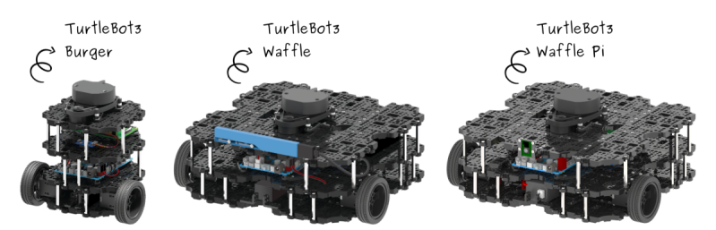

# Corso Ros


# Installazione Ros

### Setup sources.list
```bash
sudo sh -c 'echo "deb http://packages.ros.org/ros/ubuntu $(lsb_release -sc) main" > /etc/apt/sources.list.d/ros-latest.list'
```

### Adding Key
```bash
sudo apt-key adv --keyserver 'hkp://keyserver.ubuntu.com:80' --recv-key C1CF6E31E6BADE8868B172B4F42ED6FBAB17C654
```

### Update package list
```bash
sudo apt-get update
```

### Installing ROS Kinetic Full Desktop Version
```bash
sudo apt-get install ros-kinetic-desktop-full
```

### Initialize Ros Dependencies
```bash
sudo rosdep init
```
```bash
rosdep update
```

### Setting up ROS Environment
```bash
printf "source /opt/ros/kinetic/setup.bash" >> ~/.bashrc
```
```bash
source ~/.bashrc
```

### Installing Python Packages for ROS
```bash
sudo apt-get install python-rosinstall
```
```bash
sudo apt install python-catkin-tools
```

### Other Important ROS Packages
```bash
sudo apt-get install ros-kinetic-tf-*
```
```bash
sudo apt-get install ros-kinetic-pcl-msgs ros-kinetic-mav-msgs ros-kinetic-mavros ros-kinetic-octomap-* ros-kinetic-geographic-msgs libgeographic-dev
```

### Creating Catkin Workspace
```bash
mkdir catkin_ws
```
```bash
cd catkin_ws
```
```bash
mkdir -p src
```
```bash
cd src
```
```bash
catkin_init_workspace
```
```bash
printf "source ~/catkin_ws/devel/setup.bash" >> ~/.bashrc
```
```bash
cd ~/catkin_ws
```
```bash
catkin_make
```
```bash
source ~/catkin_ws/devel/setup.bash
```

# Manda messaggio topic TurtleSim
```python
rostopic pub -r 1 /turtle1/cmd_vel geometry_msg/Twist [TAB] [TAB]
```

## Tabella Arcotangente


## Ros Networking

Argomento | Link
------------ | -------------
ROS NetworkSetup | http://wiki.ros.org/ROS/NetworkSetup
Running ROS across multiple REMOTE machines | http://wiki.ros.org/ROS/Tutorials/MultipleRemoteMachines

## Ros Launch

```bash
roslaunch [name_package] [name_file_launch]
```

Argomento | Link
------------ | -------------
ROS Launch| http://wiki.ros.org/roslaunch
ROS Launch Includes | http://wiki.ros.org/ROS/Tutorials/Roslaunch%20tips%20for%20larger%20projects
ROS Launch Params | http://wiki.ros.org/roslaunch/XML#Setting_parameters

### Turtlebot 3



### Installazione

```bash
$ cd
$ cd catkin_ws/src
$ git clone https://github.com/ROBOTIS-GIT/turtlebot3.git
$ cd
$ cd catkin_ws/ && catkin_make
```
